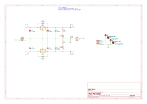
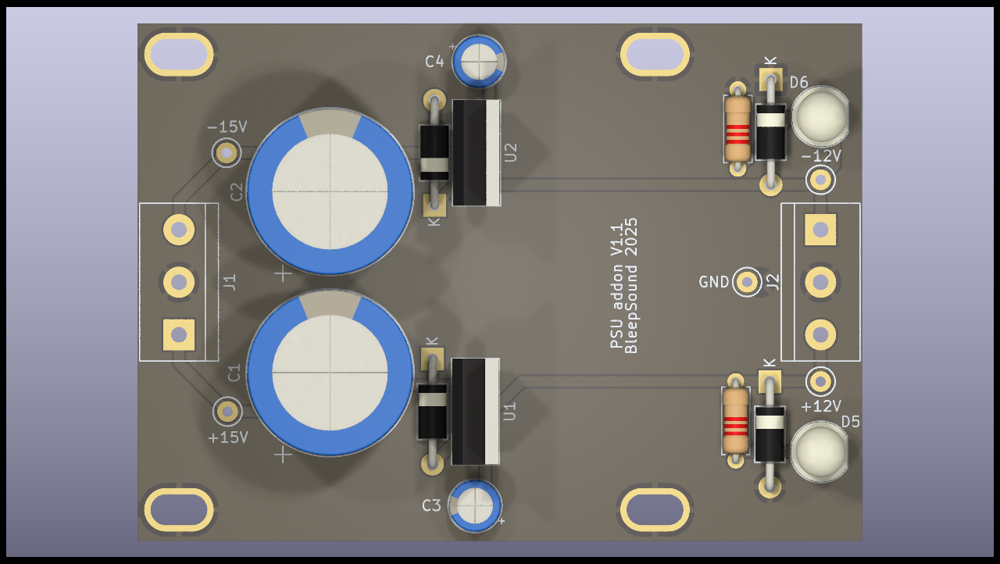
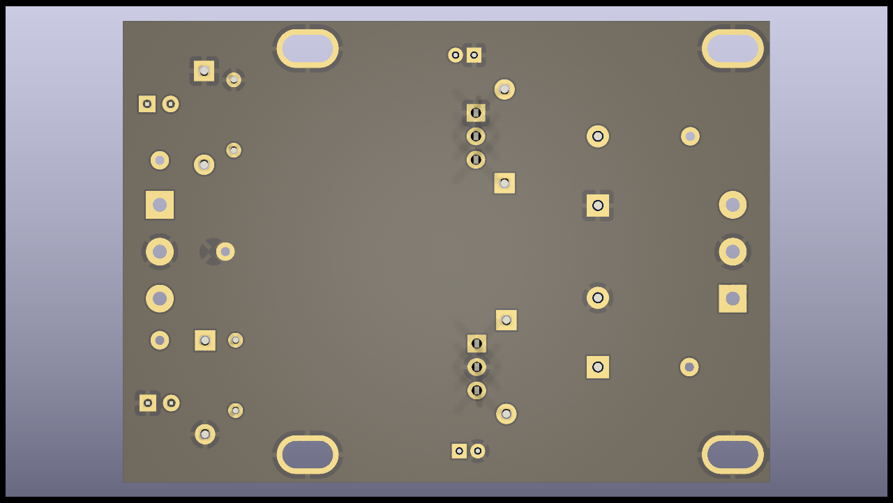
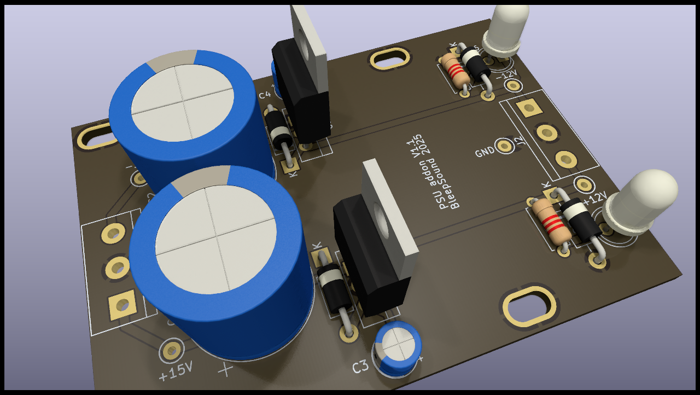

# PSU addon

PSU Addon to create a stable +/-12V voltage for your case. 
Input can be up to 35V **DC**.

This is designed to be used (in my case) with a meanwell RT65C. Input in my case will be +/-15V. 

The input capacitor is oversized because I had those lying around. But you could use anything a bit smaller. Check the voltage regulators datasheet if you want to make sure. 

## Schematics

## BoM

[See bom](documentation/bom/PSU-addon_V1.0--iBoM.html)

You have a bom in excel format available in the bom folder. 

## Build Informations

Put heatsink elements on the voltage regulators, as they will get really hot during use. 

:warning: When building modules, always do it in this order (from smallest component to highest):
- diodes
- resistors
- Electrolytic capacitors (small ones)
- Terminal blocks connectors
- Voltage regulators
- Oversized electrolytic capacitors

